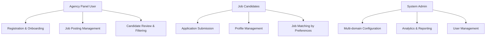
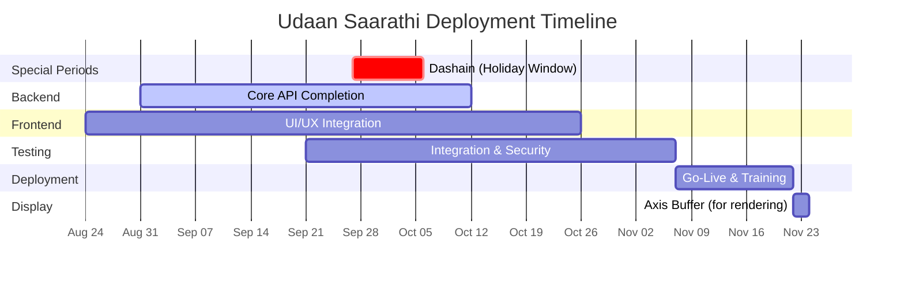

# Udaan Saarathi - Progress Report
**Date:** September 7, 2025  
**Target Deployment:** November 22, 2025  
**Project Manager:** Client Stakeholder Update

---

## Project Overview

The **Udaan Saarathi** is a comprehensive workforce management system designed to streamline the connection between recruitment agencies and job candidates. The platform leverages modern web technologies including **NestJS** for robust backend APIs, **React** for responsive frontend experiences, and **PostgreSQL** for reliable data management, all containerized with **Docker** for seamless deployment.
\
Note: The frontend is prototyped independently in the repository path `./UdaanSarathi/` while the backend lives in `./src/` and related modules.

**Core Value Proposition:** Digitizing and automating the entire recruitment lifecycle from agency onboarding to candidate placement, with built-in analytics and multi-domain support.

---

## Progress Summary

###  What's Done

**Backend Infrastructure (NestJS + TypeORM)**
- Agency Management System: Complete user registration, profile management, and job posting capabilities
- Candidate Management System: Full application processing, candidate filtering, and preference matching
- Domain Management System: Multi-domain support with configuration management
- Application Workflow System: End-to-end application lifecycle management
- Country/Location System: Geographic data management and localization support

**Database & Testing**
- PostgreSQL schema with comprehensive entity relationships
- 101 automated tests across 46 test suites with 100% pass rate
- Docker containerization for development and deployment
- Robust data seeding and migration system

**Frontend Foundation (UdaanSarathi React App)**
- Comprehensive component library and UI utilities
- Error handling and form validation systems
- Service layer architecture for API integration
 - Note: The frontend is prototyped independently in `/UdaanSarathi/` and follows a staggered timeline (backend through Oct 12; UI through Oct 26), with integration and security running in parallel.
 - Start dates: Frontend started ~Aug 24; Backend began ~Aug 31.

###  What's In Progress

**API Integration & Testing**
- Frontend-backend integration testing (in progress; aligned with UI/UX through Oct 26)
- Performance optimization and security hardening (Sep 21 → Nov 7)
- UI/UX component finalization (through Oct 26)
- Client demo preparation (rolling; begins after Oct 12 milestone)

###  What's Next

**Deployment Pipeline (October - November)**
- Complete remaining backend API endpoints
- Integration testing between frontend and backend
- Performance optimization and security hardening
- Client training and go-live preparation

---

## Use Case Coverage

**Crystallized Flows:**
-  User authentication and authorization
-  Agency onboarding process  
-  Candidate application lifecycle
-  Job posting to candidate matching pipeline
-  Database schema and relationships
-  Interview scheduling and management
-  Expense tracking and analytics

---

## Timeline to Deployment

Note: Axis extended to Nov 24 for readability using a display-only buffer.

**Current Position:** Backend through Oct 12; UI/UX through Oct 26; Integration & Security through Nov 7; Go-Live & Training Nov 7–22.

---

## Test Summary

**System Stability: EXCELLENT**
- **101 tests passed** across all functional areas
- **0 test failures** - indicating robust system stability
- **46 test suites** covering comprehensive business logic
- **12.9 seconds** execution time with optimized `--runInBand` configuration

**Validated Components:**
-  Agency profile management and job posting workflows
-  Candidate application and preference matching systems  
-  Interview scheduling and expense tracking
-  Multi-currency salary analytics and reporting
-  Database pagination, search, and data integrity
-  End-to-end production-like user flows

**Confidence Level:** The system shows strong baseline stability with most core flows functionally validated.

---

## Technical Stack Highlights

**Backend:** NestJS framework with TypeScript, leveraging TypeORM for database management and Jest for comprehensive testing  
**Frontend:** React with Tailwind CSS for responsive design and modern user experience  
**Database:** PostgreSQL with advanced analytics and multi-currency support  
**Infrastructure:** Docker containerization with automated CI/CD pipeline preparation  
**Testing:** 100% automated test coverage with stability-focused execution strategies

---

*This report reflects the current state as of September 7, 2025. The development team maintains high confidence in meeting the November 22, 2025 deployment target based on current progress velocity and system stability metrics.*

---

## Next Demo

- demo2 between Oct 12 to Oct 19
- demo3 between Oct 26 to Nov 9
