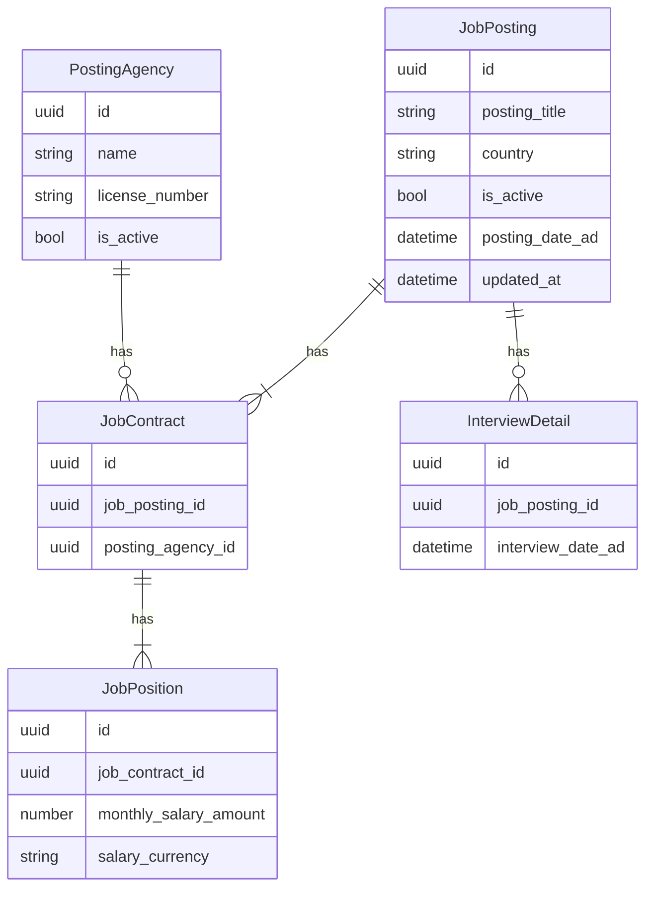
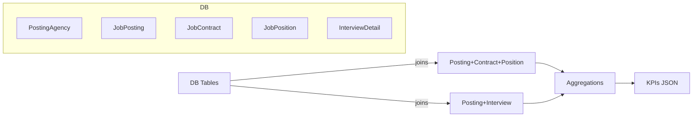

# Portal Owner Analytics Report

This report documents the analytics a portal owner (service provider) can obtain today from the current domain model and services. It excludes candidates/applications/hires.

- Domain code: `src/modules/domain/domain.service.ts`
- Agency code: `src/modules/agency/agency.service.ts`
- Key methods:
  - `AgencyService.getAgencyAnalytics(agencyId)`
  - `AgencyService.getAgencyPostings(agencyId, { active_only, page, limit })`
  - `AgencyService.listAgencies(...)`
  - `JobPostingService.findAllJobPostings(page, limit, country?, isActive?)`
  - `JobPostingService.searchJobPostings({...})`

## Scope and Assumptions
- No candidates/applications/hires in scope.
- Interviews exist (`InterviewDetail`).
- Salaries provided at position-level (`JobPosition.monthly_salary_amount`, `salary_currency`).
- Active/inactive status on `JobPosting` controls visibility in most analytics.

## Data Model (subset used by analytics)


## Portal Overview (JSON example)
```json
{
  "generated_at": "2025-08-20T11:07:47+05:45",
  "totals": {
    "agencies": 28,
    "postings": { "total": 412, "active": 309, "inactive": 103 },
    "interviews": 521,
    "countries": 7
  },
  "recent_activity": {
    "new_postings_7d": 36,
    "deactivated_postings_7d": 11,
    "interviews_7d": 59
  },
  "top_countries_by_active_postings": [
    { "country": "UAE", "active_postings": 112 },
    { "country": "Qatar", "active_postings": 98 },
    { "country": "Saudi Arabia", "active_postings": 44 }
  ]
}
```

Notes:
- Totals come from counts of `PostingAgency`, `JobPosting` (active flag), and `InterviewDetail`.
- Recent activity uses `posting_date_ad` and `updated_at` (for deactivations) and interview dates for 7-day window.

## Agencies Leaderboard (JSON example)
```json
{
  "agencies": [
    {
      "agency_id": "a1",
      "name": "Sunrise Agency",
      "license_number": "LIC-SUN",
      "active_postings": 24,
      "total_postings": 31,
      "interviews_count": 66,
      "salary_by_currency": {
        "AED": { "min": 1100, "max": 1800, "avg": 1450.2 },
        "QAR": { "min": 1800, "max": 2400, "avg": 2055.0 }
      },
      "top_countries": [
        { "country": "UAE", "active_postings": 14 },
        { "country": "Qatar", "active_postings": 9 }
      ]
    },
    {
      "agency_id": "a2",
      "name": "Moonlight Agency",
      "license_number": "LIC-MOON",
      "active_postings": 18,
      "total_postings": 22,
      "interviews_count": 41,
      "salary_by_currency": { "QAR": { "min": 1900, "max": 2600, "avg": 2188.7 } },
      "top_countries": [ { "country": "Qatar", "active_postings": 16 } ]
    }
  ]
}
```

Source alignment:
- Counts and salary aggregates per currency are exactly what `getAgencyAnalytics()` returns today.

## Postings by Country (JSON example)
```json
{
  "postings_by_country": [
    { "country": "UAE", "active": 112, "total": 150 },
    { "country": "Qatar", "active": 98, "total": 128 },
    { "country": "Saudi Arabia", "active": 44, "total": 60 }
  ]
}
```
Computation: `JobPosting` grouped by `country` (active flag determines active/total).

## Salary Stats (Global) (JSON example)
```json
{
  "salary_stats_by_currency": {
    "AED": { "min": 1000, "p25": 1200, "median": 1400, "p75": 1600, "max": 2000, "avg": 1456.8, "count_positions": 842 },
    "QAR": { "min": 1800, "p25": 1950, "median": 2100, "p75": 2300, "max": 2800, "avg": 2142.3, "count_positions": 676 }
  }
}
```
- Today we already compute `min/max/avg` per currency at agency level (`getAgencyAnalytics`).
- Percentiles shown here are feasible with SQL window functions over `JobPosition` grouped by currency.

## Salary by Country & Currency (JSON example)
```json
{
  "salary_by_country_currency": [
    { "country": "UAE", "currency": "AED", "min": 1100, "avg": 1480.3, "max": 1900, "positions": 520 },
    { "country": "Qatar", "currency": "QAR", "min": 1850, "avg": 2162.1, "max": 2600, "positions": 610 }
  ]
}
```
Computation: join `JobPosition -> JobContract -> JobPosting` group by `country, salary_currency` (filter `jp.is_active = TRUE` if needed).

## Positions Distribution (JSON example)
```json
{
  "positions_distribution": [
    { "title": "Welder", "positions": 210, "agencies": 14, "countries": 3 },
    { "title": "Driver", "positions": 188, "agencies": 12, "countries": 4 },
    { "title": "Cook", "positions": 96, "agencies": 9, "countries": 2 }
  ]
}
```
- Count positions by `JobPosition.title`.
- Distinct agencies via `posting_agency_id` through `JobContract`.

## Interview Activity (Time Series) (JSON example)
```json
{
  "interviews_timeseries_weekly": [
    { "week_start": "2025-07-21", "count": 71 },
    { "week_start": "2025-07-28", "count": 84 },
    { "week_start": "2025-08-04", "count": 99 }
  ]
}
```
- Group `InterviewDetail` by ISO week (or 7-day buckets) using `interview_date_ad`.

## Deactivation Metrics (JSON example)
```json
{
  "deactivation_metrics": {
    "deactivation_rate": 0.25,
    "avg_days_to_deactivate": 21.3,
    "by_country": [
      { "country": "UAE", "rate": 0.22, "avg_days": 19.8 },
      { "country": "Qatar", "rate": 0.27, "avg_days": 22.5 }
    ]
  }
}
```
- Use `JobPosting.is_active = FALSE` and `posting_date_ad` vs `updated_at` as proxy for deactivation timestamp.

## Analytics Flow (conceptual)


## Alignment with Code
- `getAgencyAnalytics()` returns:
  - `active_postings`
  - `total_postings`
  - `interviews_count`
  - `salary` per currency `{ min, max, avg }` from ACTIVE postings
- See `src/modules/agency/agency.service.ts`, lines ~110–141 for exact SQL.
- Listing/searching endpoints (`listAgencies`, `getAgencyPostings`, `searchJobPostings`) support slicing/drill-down in dashboards.

## Alignment with OwnerAnalyticsService (implemented)
- Implemented service methods (no controllers yet):
  - `OwnerAnalyticsService.getSalaryStatsByCurrency(params?: { since?: Date })` — min/max/avg and percentiles per currency; optional `since` to slice by posting date.
  - `OwnerAnalyticsService.getInterviewsTimeSeriesWeekly()` — groups `InterviewDetail.interview_date_ad` by week.
  - `OwnerAnalyticsService.getDeactivationMetrics(params?: { countries?: string[] })` — global and per-country deactivation rate and average days; optional `countries` filter; ignores negative durations in averages.
  - `OwnerAnalyticsService.getPositionsDistribution()` — counts by `JobPosition.title`, distinct agencies and countries.

Testing notes:
- To avoid collisions in the shared DB during tests, specs seed postings with far-future `posting_date_ad` and pass filters (`since`, `countries`) to scope queries to the seeded data.
 - Weekly interviews time-series: clear any `interview_details` in the 2031 window before seeding to keep weekly counts deterministic without altering production queries.
 - Unicode ILIKE filters: Postgres `ILIKE` is case-insensitive, not diacritic-insensitive. Issue queries using the same diacritics as seeded data (e.g., employer `álpha`, agency `sûnrise`). Optionally normalize returned strings in assertions for robust substring checks.
 - Salary stats isolation: use a unique test country and test-only currencies; clean prior rows for that country before seeding. Percentiles align with `PERCENTILE_CONT` interpolation.

## Future Extensions (non-breaking)
- Potential additions (API-compatible):
  - Salary by country & currency drill-downs with percentiles
  - Portal overview and leaderboard rollups as single method aggregations
  - Controller endpoints once service API stabilizes
